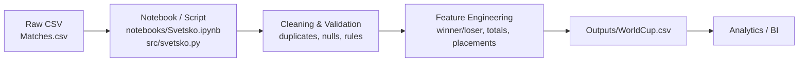

# Architecture

This project follows a simple analytics engineering workflow focused on cleaning and transforming the FIFA World Cup matches dataset into an analytics-ready table.

```mermaid
flowchart LR
    A[Raw CSV<br/>Matches.csv] --> B[Notebook / Script<br/>notebooks/Svetsko.ipynb<br/>src/svetsko.py]
    B --> C[Cleaning & Validation<br/>duplicates, nulls, rules]
    C --> D[Feature Engineering<br/>winner/loser, totals, placements]
    D --> E[Outputs/WorldCup.csv]
    E --> F[Analytics / BI]
```
